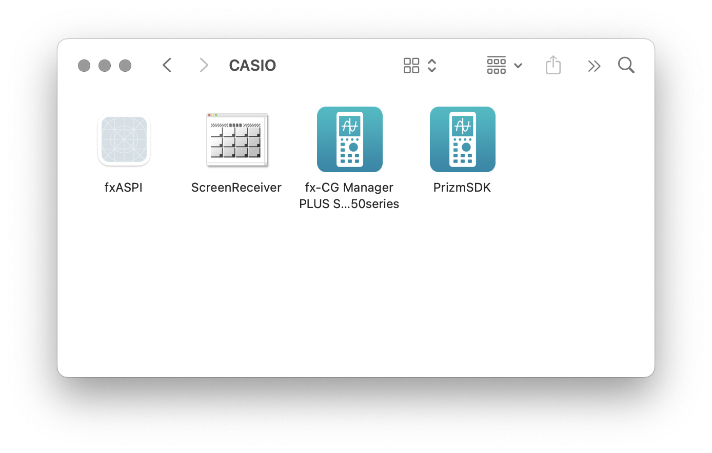
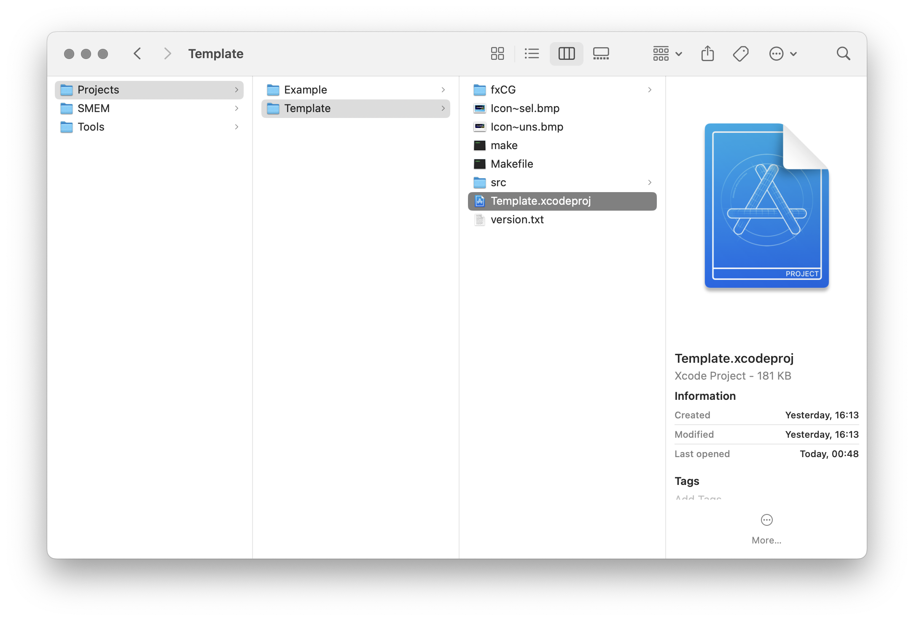
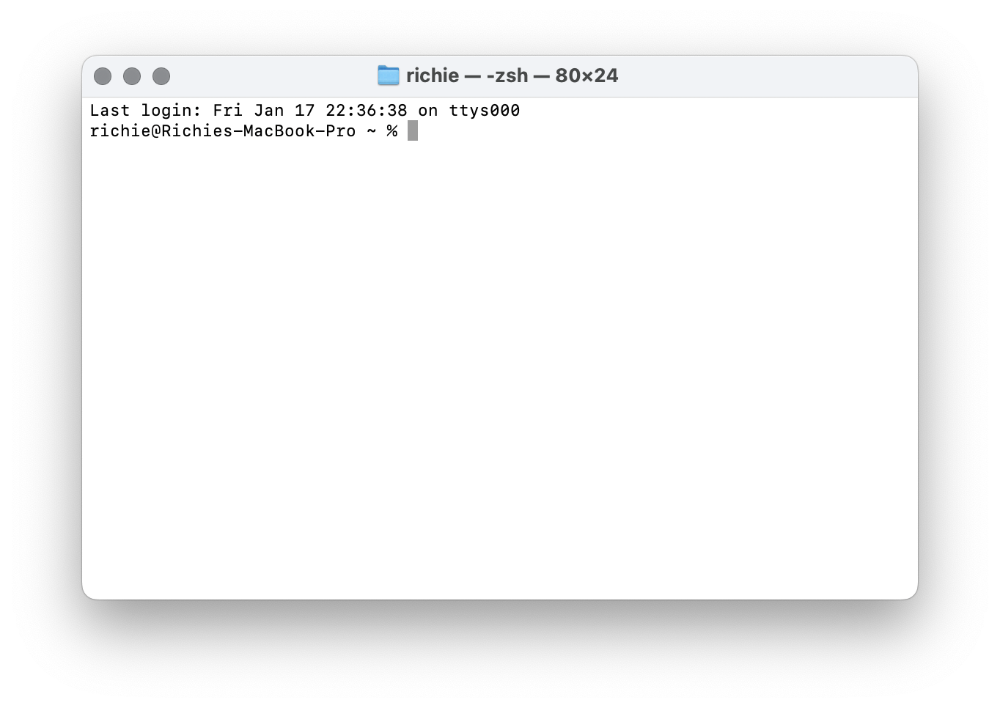
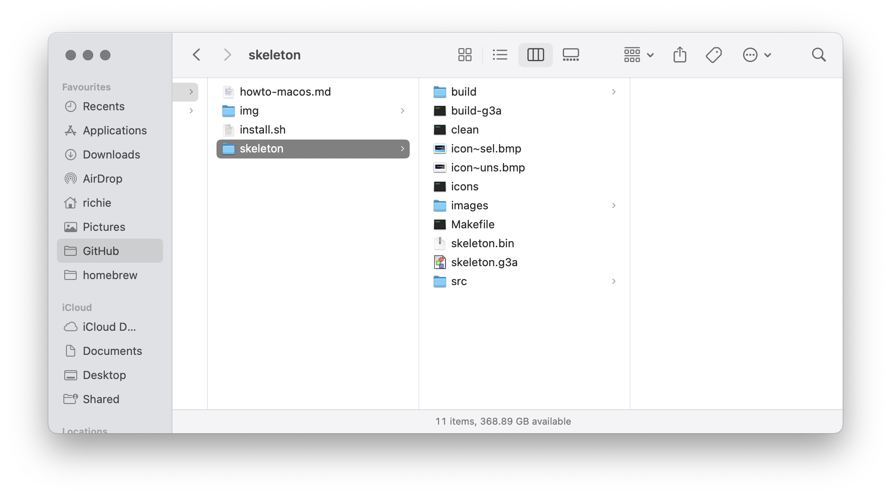

# Getting started on macOS

This document will walk you through the process of setting up the <a href="https://github.com/Jonimoose/libfxcg">PrizmSDK</a> and building your first add-in on macOS.

## Download PrizmSDK

Download an PrizmSDK binary for Intel or AppleSilicon from the [releases page](https://github.com//Insoft-UK/libfxcg/releases/) and unpack to your Applications/CASIO folder.



Make sure macOS knows the path of the PrizmSDK.
```
export FXCGSDK=/Applications/CASIO/PrizmSDK
grep -qxF 'export PATH=/Applications/CASIO/PrizmSDK:/Applications/CASIO/PrizmSDK/bin:/Applications/CASIO/PrizmSDK/sh3eb-elf/bin:$PATH' ~/.zshrc || echo 'export PATH=/Applications/CASIO/PrizmSDK:/Applications/CASIO/PrizmSDK/bin:/Applications/CASIO/PrizmSDK/sh3eb-elf/bin:$PATH' >> ~/.zshrc
grep -qxF 'export FXCGSDK=/Applications/CASIO/PrizmSDK' ~/.zshrc || echo 'export FXCGSDK=/Applications/CASIO/PrizmSDK' >> ~/.zshrc
source ~/.zshrc
```

>[!NOTE]
If using the **pre-binary** file, you may require `libpng gmp mpfr libmpc isl imagemagick` are installed.
`brew install libpng gmp mpfr libmpc isl imagemagick`
The installer package is for AppleSilicon only.

## Example Project

Download the Prizm folder from the GitHub Repositories [Prizm](https://github.com/Insoft-UK/PrizmSDK/tree/main/Prizm) and copy to your ~/Documents folder.
Navigate to `Prizm/Projects`, then `Template`. This directory contains an Xcode project example project to get you started with and looks like this:



The `Icon~sel.bmp` and `Icon~uns.bmp` images are built into the compiled add-in and are the icons shown in the calculator's menus for the add-in when it is selected with the cursor and unselected, respectively.

`Makefile` is a plain-text file that includes instructions that tell the system how to compile the add-in. You can edit this with any text editor of your choice, but in most cases don't need to (and probably shouldn't unless you know what you're doing). If you're just getting started, it's safe to ignore this file. Similarly, `make` allows you to run a single command and compile the add-in and you shouldn't need to touch it.

## Compile the Example project

To compile the Example project, simply run `make.sh` in the project directory
using the Terminal.



The `Example.g3a` file is ready to send to your calculator for running now.



## Making changes and rebuilding

Every time you run `make` as above, the system will rebuild the g3a file if there have been any changes to the sources. It's possible that won't always work as you expect, so you can also run `.\make clean` to erase the output files from the compilation process and ensure you're building a totally fresh version.

Using the provided **make** script in the Example folder will automatically clean up after building the 3ga file, streamlining the development process.

## Making your own project

Now that you know how to build an add-in, it's time to write your own program. Make a copy of the `Example` project and call it something else (probably a name related to what your project is), then you can write your own code however you like.
